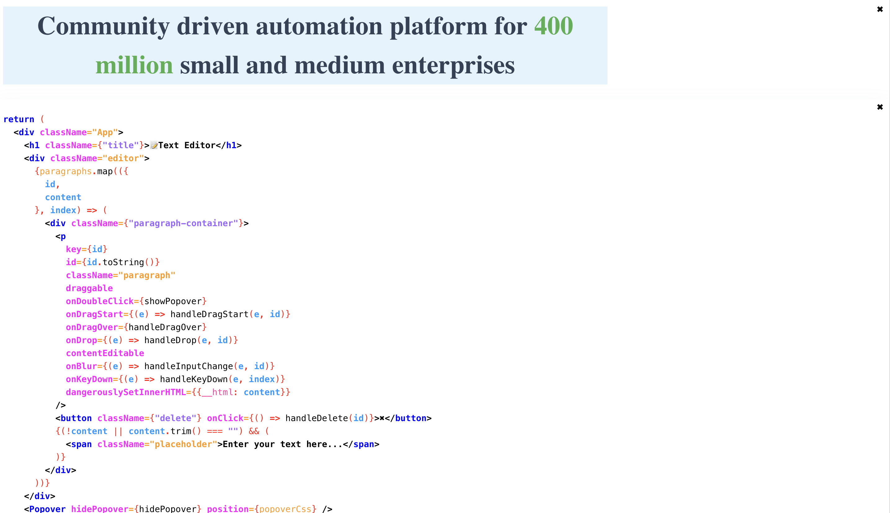

# Front-End Challenge: Text Editor Overview

## Overview
In this challenge, the task is to develop a simple text editor inspired by platforms like Medium.com. The text editor should enable users to create, format, and organize text easily. Creativity in implementation and design is encouraged.

## Core Requirements

### Task 1: Basic Text Editor Features
- Pressing the 'Enter' key should start a new paragraph.
- Allow users to drag and rearrange paragraphs within the document.

### Task 2: Text Formatting
- On double-clicking any word or selection of text, display a tooltip offering three options:
  - Bold: Make the selection bold.
  - Underline: Underline the selection.
  - Color Change: Change the selection color to the color of your choice.

### Task 3: Link Embedding Support
- Users can embed links using a specific tag format. It can follow the markdown link embedding format as follows: `(this is a link)[<http://medium.com/>]`
- When a user finishes editing and clicks “Done,” the editor should convert these tags into clickable text links (like this: This is a link).
- All the embedded links should be displayed outside the editor as a reference list in the same order as they appear in the editor.
  - This list should use two alternate colors of your choice to display the links outside the editor, e.g., Red, Blue, Red, etc.
                                    

## Implementation
- **New Line:** Use the keyboard shortcut Shift+Enter to create a new line within the text.

- **Drag and Drop:** Enable the ability to drag and drop paragraphs to rearrange their order within the document. Dragging a paragraph will push it before the dropped location.

- **Text Formatting:** Double-click on text to activate a popover menu offering options for bold, italic, and color changes.

- **Local Storage:** All data, including text content and formatting changes, are stored locally using the browser's local storage.

- **Text Editing:** The editor allows for normal text input along with the application of bold, italic, and color CSS styles to the text.

- **Preserved CSS on Copy-Paste:** Copying and pasting content retains its formatting, including any applied CSS styles such as bold, italic, or color.

- **Local Storage Persistence:** Utilize local storage to retain the document's data, ensuring that changes made are saved and can be restored upon subsequent visits or reloads of the page.

Check out : [TextEditor](https://kongnitos-editor.vercel.app/)

